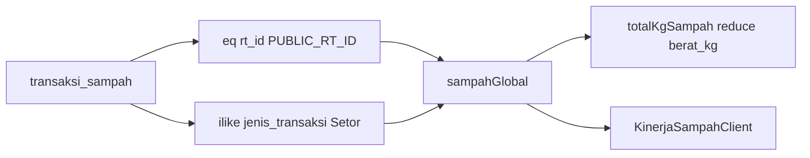

# Perbaikan UUID query bank sampah publik

## Fakta di kode sekarang

Log dev server menunjukkan insiden nyata:

- `operator does not exist: uuid ~~* unknown` — `ILIKE` (`~~*`) menempel ke kolom UUID `rt_id`
- `invalid input syntax for type uuid: "%00000000-0000-0000-0000-000000000007%"` — nilai `rt_id` dibungkus `%...%` lalu dikirim sebagai UUID

Klaim “menahan seluruh rendering” **tidak tepat secara teknis**. `Promise.all` di [`app/page.tsx`](app/page.tsx) tidak melempar: PostgREST mengembalikan `{ error }`, lalu [`dataAtauKosong`](app/page.tsx) (label `"bank sampah"`) menelan error dan `sampahGlobal = []`. Halaman tetap 200, tetapi kartu **Dialihkan dari TPA** dan [`KinerjaSampahClient`](app/portal/KinerjaSampahClient.tsx) kosong.

Di disk, baris 241 **sudah** berbentuk yang diminta:

```241:241:app/page.tsx
    supabase.from("transaksi_sampah").select("berat_kg, nominal_warga, nominal_kas_rt, tanggal_transaksi").eq("rt_id", PUBLIC_RT_ID).ilike("jenis_transaksi", "%Setor%"),
```

Tidak ada sisa `.ilike("rt_id", ...)` atau `` `%${PUBLIC_RT_ID}%` `` di repo. Compile terakhir di terminal sudah tidak lagi mencetak error bank sampah.

Saat eksekusi: baca ulang baris itu. Jika masih exact seperti di atas, **jangan edit no-op**. Jika buffer editor masih membawa wildcard di `rt_id`, ganti **hanya** query `transaksi_sampah` menjadi bentuk kanonik di bawah.

## Perubahan (satu query, satu file)

Hanya entri `transaksi_sampah` di `Promise.all` di [`app/page.tsx`](app/page.tsx). Dilarang mengubah `ambilKasRt`, `ambilDemografiSah`, `ambilKunjunganPosyanduRt`, jumantik, kurban, atau query lain di array yang sama.

Bentuk wajib:

```ts
supabase
  .from("transaksi_sampah")
  .select("berat_kg, nominal_warga, nominal_kas_rt, tanggal_transaksi")
  .eq("rt_id", PUBLIC_RT_ID)
  .ilike("jenis_transaksi", "%Setor%")
```

- `rt_id` = `.eq` ke `PUBLIC_RT_ID` mentah (UUID vanity `...0007` sah karena regex kanonik 8-4-4-4-12 di atas file).
- `jenis_transaksi` = `.ilike("%Setor%")` di kolom **teks**, bukan di UUID. Mencakup nilai kanonik `"Setor"` (portal/admin) dan varian `"Setoran"` jika ada; tidak menarik `"Tarik"`.



## Efek domino 1 — `totalKgSampah`

[`totalKgSampah`](app/page.tsx) hanya menjumlah `Number(t.berat_kg || 0)` atas array hasil. Tidak membaca `jenis_transaksi` atau `rt_id`. Filter setoran di SQL **kompatibel**: tarikan biasanya `berat_kg` 0/null, dan KPI publik adalah “dialihkan dari TPA” = setoran, bukan tarik saldo.

Efek samping yang diinginkan: [`KinerjaSampahClient`](app/portal/KinerjaSampahClient.tsx) juga memakai `sampahGlobal` untuk kg + `nominal_warga + nominal_kas_rt`. Tanpa filter Setor, tarikan bisa menggelembungkan/menyesatkan grafik valuasi. Select tetap menyediakan ketiga kolom yang dipakai chart. Reduce **tidak** diubah.

## Efek domino 2 — isolasi

Query lain di `Promise.all` sudah `.eq("rt_id", PUBLIC_RT_ID)` / helper dengan `rtId`. Tidak disentuh. `revalidatePath("/")` di admin sampah tetap sah.

Tidak menambah paginasi `.range` pada query ini (di luar scope). Default max-rows PostgREST (~1000) tetap batas teknis yang sudah ada.

## Verifikasi

- Muat `/` di browser: log tidak lagi `Portal publik gagal memuat bank sampah` dengan UUID ber-% ; kartu kg dan chart lingkungan terisi jika ada setoran tenant `PUBLIC_RT_ID`.
- `#demografi`, `#kas`, `#kesehatan` tidak berubah perilaku.
- Diff: hanya [`app/page.tsx`](app/page.tsx), dan hanya jika baris 241 masih salah.