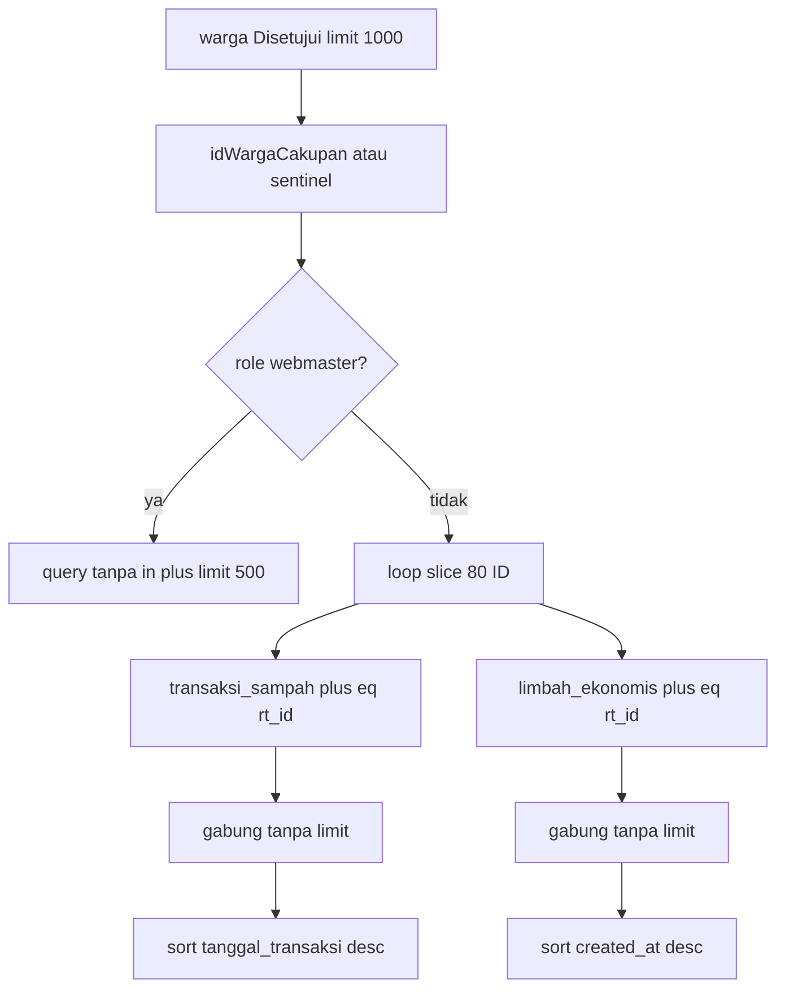

# P2: Chunk `.in()` Admin Sampah

Hanya satu file: [`app/admin/sampah/page.tsx`](app/admin/sampah/page.tsx). UI (`SampahAdminClient.tsx`), RLS, server actions, dan file lain tidak disentuh.

## Masalah

Untuk admin RT (bukan webmaster), dua query masih menembakkan seluruh allow-list warga sekali:

```32:50:app/admin/sampah/page.tsx
  let queryTransaksi = supabaseAdmin.from("transaksi_sampah").select("*, warga(nama_lengkap)").order("tanggal_transaksi", { ascending: false }).limit(500);
  if (otentikasi.sesi.role !== "webmaster") {
    queryTransaksi = queryTransaksi.in("warga_id", ids).eq("rt_id", otentikasi.sesi.rtId);
  }
  // ...
  if (otentikasi.sesi.role !== "webmaster") queryRak = queryRak.in("warga_id", ids).eq("rt_id", otentikasi.sesi.rtId);
```

PostgREST menaruh `.in()` di query string. >80 UUID → HTTP 400 → `transaksiList` kosong → `totalBerat`, `totalSaldoWarga`, dan `saldoUserTerpilih` di klien jadi 0 palsu. Pola yang sudah benar ada di [`app/admin/kurban/page.tsx`](app/admin/kurban/page.tsx) (`UKURAN_KELOMPOK = 80`, helper loop, gabung, sort).

Tidak ada query kurban di halaman ini. Yang ada: `transaksi_sampah` dan `limbah_ekonomis`. Keduanya memakai `.in("warga_id", ids)` — keduanya harus di-chunk, kalau tidak query rak bin tetap 400 dan halaman masih gagal.

## Implementasi (hanya file ini)

1. Tambah import `type SupabaseClient` dari `@supabase/supabase-js` dan konstanta `UKURAN_KELOMPOK = 80` (sudah ada `UUID_SENTINEL`).

2. Helper lokal meniru `ambilKurbanCakupan` / `ambilSampahCakupan` di kurban:

- `ambilTransaksiSampahCakupan(supabase, ids, rtId)`: loop `slice` 80 ID, `.from("transaksi_sampah").select("*, warga(nama_lengkap)").in("warga_id", potong).eq("rt_id", rtId)`. **Tanpa** `.limit(500)` per potongan maupun setelah gabung. Setelah semua chunk: `sort` `tanggal_transaksi` menurun (`localeCompare` seperti kurban).
- `ambilRakBinCakupan(supabase, ids, rtId)`: loop yang sama pada `limbah_ekonomis` dengan select/filter yang sudah ada (`.not("warga_id"/"rt_id", "is", null)`). Tanpa `.limit(500)` per batch. Setelah gabung: urutkan `created_at` menurun (kolom order yang sudah dipakai; tabel ini tidak punya `tanggal_transaksi`).

`.eq("rt_id", ...)` **tetap** di setiap chunk — ini filter aplikasi berlapis, bukan perubahan RLS. Baris legacy tanpa `rt_id` tetap tersembunyi.

3. Path **webmaster** tidak berubah: tetap tanpa `.in()`, tetap `.limit(500)` pada transaksi dan rak.

4. Path non-webmaster: panggil kedua helper dengan `ids` (sentinel jika RT kosong), jangan pakai query `.in()` sekali tembak. `queryTeknisi` tidak memakai `.in("warga_id")` — biarkan.

5. **Dilarang:** mengubah `simpanTransaksiSampah`, `updateStatusRakBin`, JSX, atau file lain.



## Dampak

- Yang berubah: fetch non-webmaster di `/admin/sampah`. Agregat kg/saldo di klien memakai array lengkap, bukan 500 baris pertama / hasil 400.
- Yang tidak berubah: validasi tarik di server action (tetap query per `warga_id` + `rt_id`), RLS, UI.
- Webmaster tetap ter-cap 500; itu path yang sudah ada, bukan regresi chunking.
- Default max-rows PostgREST (~1000 per request) tetap berlaku per chunk — sama seperti Kurban P1; jangan tambah paginasi `.range`.

## Verifikasi

- Browser `/admin/sampah` sebagai admin RT (bukan webmaster) pada tenant >80 warga: Network tidak 400 pada `warga_id=in.(...)`; request terpecah ≤80 UUID; total kg dan saldo bukan 0 palsu; baris tabel terbaru di atas.
- Webmaster: tetap tanpa `.in()` massal.
- Jangan buka/ubah modul lain sebagai bagian tugas ini.